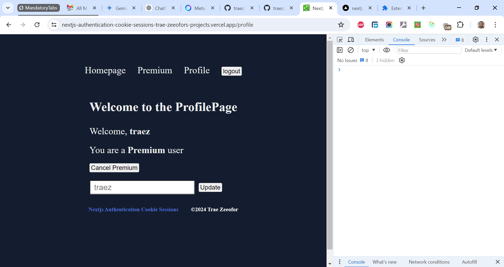

# Basic Authentication in Nextjs with Cookie Sessions

This is a solution to [Next.js Auth; This is the Easiest Way To Build Auth with Cookie Sessions Project](https://www.youtube.com/watch?v=p_FiVGxyksI). I'm practicing and developing my coding competency by building projects after projects.

## Table of contents

- [Overview](#overview)
  - [The challenge](#the-challenge)
  - [Screenshot](#screenshot)
  - [Links](#links)
  - [My process](#my-process)
  - [Built with](#built-with)
  - [What I learned](#what-i-learned)
  - [Continued development](#continued-development)
  - [Useful resources](#useful-resources)
  - [Author](#author)
  - [Acknowledgments](#acknowledgments)

## Overview

### The Challenge/User Stories

Next.js cookie session auth with iron-session and server actions. Cookie-based authentication and authorization in Next.js 14 app router.

### Screenshot

### Links

- Solution URL: [https://github.com/traez/nextjs-authentication-cookie-sessions](https://github.com/traez/nextjs-authentication-cookie-sessions)
- Live Site URL: [https://nextjs-authentication-cookie-sessions-trae-zeeofors-projects.vercel.app/](https://nextjs-authentication-cookie-sessions-trae-zeeofors-projects.vercel.app/)

## My process

### Built with

- Semantic HTML5 markup
- CSS custom properties
- Flexbox and CSS Grid
- Mobile-first workflow
- [React](https://reactjs.org/) - JS library
- [Next.js](https://nextjs.org/) - React framework**
- Tailwind CSS**   
- Typescript
- Nodejs (with/without Expressjs)
- MongoDB**  
- GraphQL**    
- Redux Toolkit**  
- iron-session   

### What I learned
 
- `iron-session` is focused on managing encrypted sessions and storing them on the client side. While `Jose` is centered around creating and handling JWTs for secure data transmission and authentication.    
- Recommended **Next.js Project Structure**: Under the src folder, create `app` (for routes), `components` (for components) and `utils` (for functions, database, etc.).  
- **Public Environmental Variables**: To make a variable accessible on the client-side (browser), prefix it with `NEXT_PUBLIC_`. However, this exposes the value in the built JavaScript code, so avoid storing sensitive information like API keys here. When an environmental variable is used on the server, you can safely ignore this.    
- **OpenSSL Command**: The command openssl rand -base64 32 generates a random sequence of bytes and encodes it in Base64. To achieve the same outcome in a Node.js terminal in VSCode, run: `node -e "console.log(require('crypto').randomBytes(32).toString('base64'))"`
- **NODE_ENV Set to "production"**: When you deploy your application to a production environment, it is best practice to set the NODE_ENV environment variable to `"production"`. This triggers secure cookie behavior. During development, leave it as `"development"`. When you want to deploy, change it to `"production"` in Vercel/Render.   
- **React Canaries**: A feature in React that allows you to test new versions of React in your application before they are released as stable. It provides a way to opt-in to upcoming versions of React, allowing you to try out new features and bug fixes before they are widely available. Canaries are essentially beta versions of React that are released more frequently than stable versions.
- **useFormState**: A Hook that allows you to update state based on the result of a form action. Call useFormState at the top level of your component to create component state that is updated when a form action is invoked. You pass useFormState an existing form action function as well as an initial state, and it returns a new action that you use in your form, along with the latest form state. The latest form state is also passed to the function that you provided.   
- **Server-Side Form State in Next.js**: When you submit a form and use the server action in a Next.js app, the data is stored on the server-side. Refreshing the client browser won't wipe away the data, eg username. The server retains the data until it's explicitly cleared or updated, allowing it to persist across page reloads and navigations. The "server's data memory" refers to the memory of the Node.js process running the Next.js application. Refreshing the client-side browser or clearing cookies still persists the data. It is only when you restart the development server or close the terminal that this data is lost, as it's not stored in any persistent storage like a database or file system.

### Continued development

- More projects; increased competence!

### Useful resources

Stackoverflow  
YouTube  
Google  
ChatGPT

## Author

- Website - [Trae Zeeofor](https://github.com/traez)
- Twitter - [@trae_z](https://twitter.com/trae_z)

## Acknowledgments

-Jehovah that keeps breath in my lungs
